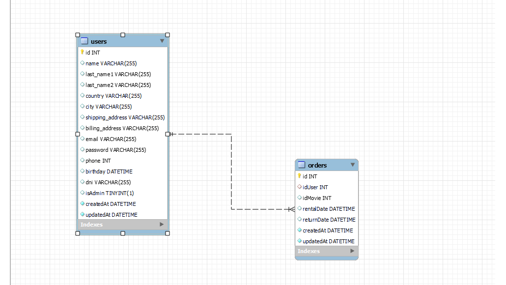

<a name="top"></a>

<h1>Backend Gym Appoinment</h1>


:speech_balloon: [About](#id1)   

:hammer: [Tools](#id2)

:clipboard: [Instructions](#id3)

:eye_speech_bubble: [Phase I - Creating the Backend](#id4)

:mailbox: [Postman](#id6)

:smile: [Thanks](#id7)

---

<a name="id1"></a>
## **About**

This is the back-end for a future Gym appointment application.

This project is part of the [GeeksHubs Academy](https://bootcamp.geekshubsacademy.com/) Full Stack Developer Bootcamp. 

---
**Phase I**
**Start date:** 01 / Jun /2021
**Deadline:** 06 / Jun / 2021


**Contributors:**
* [Pedro Agull Marco](https://github.com/PedroAgullo)
* [Mariana Fernández Sacristán](https://github.com/mlfernandez)

---

<a name="id2"></a>

## **Tools**

To create this project we worked with these tools and technologies:

|  | Visual Studio Code |

|  | JavaScript | 

|  | Node JS & Express |

|  |  MongoDB, Mongoose & Atlas | 

|  | Git |

|  | GitHub | 

|  | Postman |

|| Trello | 


<a name="id3"></a>
***
## **Instructions**
<details>

<summary>Click to expand</summary>


1. <h3> Starting Node Package Manager </h3>
   (We must have installed Node.js)
Using npm init from the command line initializes the project’s package.json file.

```javascript
npm init -y
```
2. <h3>Install the Axios dependency</h3>
Axios is a popular, promise-based HTTP client that sports an easy-to-use API and can be used in both the browser and Node.js.

```javascript
npm i axios --save
```
3. <h3> Add {"start":"node index.js"} in the file package.json section "scripts"</h3>
```json
  "scripts": {
   "start": "node index.js", 
    "test": "echo \"Error: no test specified\" && exit 1"
  },
```

4. <h3>Install framework Express </h3>
Express is a minimal and flexible Node.js web application framework that provides a robust set of features to develop web and mobile applications. It facilitates the fast development with Node based Web applications.

```javascript
npm install express --save
```

5. <h3> Delete the ^ simbol in "dependencies" file  package.json </h3>
```json
"dependencies": {
    "axios": "^0.21.1",
    "express": "^4.17.1"
  },
```

6. <h3> Add index.js on the Work space folder</h3>

7. <h3> Add .gitignore on the Work space folder and inside write</h3>
```json
/node_modules
```
8. <h3>Now we are ready to work on the backend!</h3>
>To know more about this See Creating the Backend below.

9. <h3>To conect to the server write on the terminal</h3>
```javascript
npm start
```
10. <h3>Now we can see the Data in Postman.</h3>
>To know more about this see Postman below.

</details>

<a name="id4"></a>
## Phase I Creating the Backend
<details>
<summary>Click to expand</summary>

1. <h3>index.js</h3>
*  We have to call Node Express
```javascript
const express = require('express');
```
* Save and execute.
```javascript
const app = express();
```
* Also declare the port where we are going to upload the server.
```javascript
const port = 3000; 
```
* Save the constant router and match it to the require method and tell it that we import it from router.js.
```javascript
const router = require('./router'); 
```
* Express provides you with middleware to deal with the (incoming) data (object) in the body of the request.

 * Express.json() is a method built into Express to recognize the incoming Request Object as a JSON Object. This method is called as a middleware in your application using the code.

```javascript
app.use(express.json()); 
```
* We build middleware for all application paths with.
```javascript
app.use(router);  
```
* Lift and initialize the server.
```javascript
app.listen(port, () => console.log(`Node server running on http://localhost:${port}`));
```


2. <h3>router.js</h3>

* We have to call Node Express.
```javascript
const router = require('express').Router();
```
* Call the files on the folder routes.
```javascript
const moviesRouter = require('./routes/moviesRouter');
const seriesRouter = require("./routes/seriesRouter");
```
* This says that when the user puts the path where it should go.
```javascript
router.use("/movies", movieRouter);
router.use("/series", seriesRouter);
```

* Finally export the file routers.
```javascript
module.exports = router;
```


3. <h3>utiles.js</h3>

In this file we create the functions that we need to export in other folders.
In this case, the (checkId) function transforms the users' words into genre identifiers through a for / if loop, which allows the identification numbers to be searched in the Database to be translated.

We added a case-sensitivity so that no matter how it's written, it can be found anyway.
Finally we export this file, so that we can use it in other files.

```javascript
 const checkId = (nombre) => {
  let traductorGenero = [
    {
      id: 28,
      name: "action",
    ...
    {
      id: 37,
      name: "western",
    },
    
  ];
  
  for (let i = 0; i < traductorGenero.length; i++) {
    if (traductorGenero[i].name === nombre) {
      return traductorGenero[i].id
    }
  }
};
 
module.exports = checkId;
```


4. <h3>controllers</h3>

Controllers contain callback functions which we pass to the router's methods. 

We will need one for each, Movies and Series.

First  call Axios, this is a popular, promise-based HTTP client that sports an easy-to-use API and can be used in both the browser and Node.js.

And the function  export in utiles.

```javascript
const axios = require("axios");
const checkId = require("../utiles");
```
Then we create the callbacks funtions with the endopoint to the The Movie Database.
This is an example in class Peliculas, a function to search the Top Rated Movies.

```javascript

class Peliculas {
  async findTopRated() {
    let res = await axios.get(
      "https://api.themoviedb.org/3/movie/top_rated?api_key=210d6a5dd3f16419ce349c9f1b200d6d&language=en-US&page=1"
    );

    return res.data;
  }

let moviesController = new Peliculas();
module.exports = moviesController;

```


5. <h3>routes</h3>

A route is a section of Express code that associates an HTTP verb (GET, POST, PUT, DELETE, etc.), a URL path/pattern, and a function that is called to handle that pattern.

```javascript
const router = require("express").Router();
const moviesController = require("../controllers/moviesController");
```
We have one for each Series and Movies, this is a example of one of this to search Top Rated Movies.

```javascript
router.get("/", async (req, res) => {
  try {
    res.json(await moviesController.findTopRated());
  } catch (err) {
    return res.status(500).json({
      mensaje: err.mensaje,
    });
  }
});

module.exports = router;
```
</details>
<a name="id5"></a>


## Phase II - Creating the Backend

<details>
<summary>Click to expand</summary>

1. #### Installing dependecies
```javascript
npm install sequelize --save
npm install sequelize-cli --save
npm install mysql2 --save
```

2. #### Sequelize Init
```javascript
sequelize init
```
**Sequelize init:** It will create the necessary folder and files. Sequencing model: generate: will create the model and the respective migration. ... Sequelize db: Migrate: Undo: All: Will revert all migrations executed. Sequence Seed: Generate - Will create the fake data seeder.

3. #### Create a database in Workbrench 
First you have to install sql with workbrench.

MySQL Workbench is a unified visual tool for database architects, developers, and DBAs. MySQL Workbench provides data modeling, SQL development, and comprehensive administration tools for server configuration, user administration, backup, and much more.

4. #### Modify config.json
Change password and database information
```javascript
{
  "development": {
    "username": "root",
    "password": "db_password",
    "database": "db_name",
    "host": "127.0.0.1",
    "dialect": "mysql"
  },

```  

5. #### Create db.js to connect the db, and modify index.js

<details>
<summary>Expand the see the code</summary>

```javascript
const config = require('./config/config.json');
const {Sequelize, DataTypes} = require('sequelize');

const sequelize = new Sequelize(
    process.env.MYSQL_DATABASE || config.development.database, 
    process.env.MYSQL_USER || config.development.username, 
    process.env.MYSQL_PASSWORD || config.development.password,
    {
        host: process.env.MYSQL_HOST || config.development.host,
        port: process.env.MYSQL_PORT || config.development.port || '3306',
        dialect: 'mysql',
        operatorAliases: false,
        pool: {
            max: 5,
            min: 0,
            acquire: 30000,
            idle: 10000
        },
    }
);

module.exports = sequelize.authenticate()
.then((db)=>{
    console.log('MYSQL connected'); 
    return db;
});
```
</details>

6. ### Generate Models with sequelize
We generate two models, User and Order. We have to write the attributes of each one and the migration associations. Then we could check the relation on workbrench like this.



7. ### Creating new endpoints using the db and postman

>Creating new endpoints so that users can register in our database and be able to login with their email and password.
<details>
<summary>Click to see the endpoint samples. </summary>

```javascript
// Modify orders
router.put('/', authenticate, async (req, res) => {
    try {
        const cuerpoDeDatos = req.body;
        res.json(await orderController.modifyOrder(cuerpoDeDatos));
    }catch (err) {
        return res.status(500).json({
            message: err.message
        });
    }
});
// Delete orders 
router.delete('/:id', admin, async (req, res) => {
    try {
        const id = req.params.id;
        res.json(await orderController.deleteOrder(id));
    }catch (err) {
        return res.status(500).json({
            message: err.message
        });
    }
});
```
</details>

  8. ### Install the encryption dependency and add them to the login functions.

   * First we install the bcrypt dependencies.

   The **bcrypt** hashing function allows us to build a password security platform that scales with computation power and always hashes every password with a salt.

  ```javascripts
  npm i bcrypt --save
  ```
  * And the jsonwebtoken

  A **JSON web token**, or JWT (“jot”) for short, is a standardized, optionally validated and/or encrypted container format that is used to securely transfer information between two parties

  ```javascripts
  npm install jsonwebtoken
  ```
For explample in the login function we use both, bcrypt and jsonwebtoken

```javascripts
const userController = require('./usersController');
const bcryptjs = require('bcryptjs');
const jwt = require('jsonwebtoken');
const secret = "Esto es lo mas dificil del bootcamp";


class LoginController {
    async validate(emailCheck,passwordCheck){

        let user = await userController.findByEmail(emailCheck);

        let password = user.password;

        let verificar = await bcryptjs.compare(passwordCheck,password);

        if(!verificar){
            return new Error("El password o el email no coinciden");
            
        }

        let payload = {
            userId : user.id,
            createdAt: new Date,
            isAdmin: user.isAdmin
        };

        return jwt.sign(payload,secret);

    }
}

let loginController = new LoginController();
module.exports = loginController;
```


</details>

<a name="id6"></a>
***
## **Postman**

>Postman is a collaboration platform for API development. Postman's features simplify each step of building an API and streamline collaboration so you can create better APIs—faster.

**Example of endpoints on Postman**
<details>
<summary>Click to see the endpoints on Postman. </summary>


</details>

[](https://app.getpostman.com/run-collection/042f2c63c893845e50f1?action=collection%2Fimport)

Or [click here to the API Documentation](https://documenter.getpostman.com/view/15824691/TzXzCGpm)


<a name="id7"></a>
***
## **Thanks**

We would like to thank our teacher, David, for his help and dedication. And to our bootcamp partners for all the help and every suggestion received.

<br>
<br>

[UP](#top)